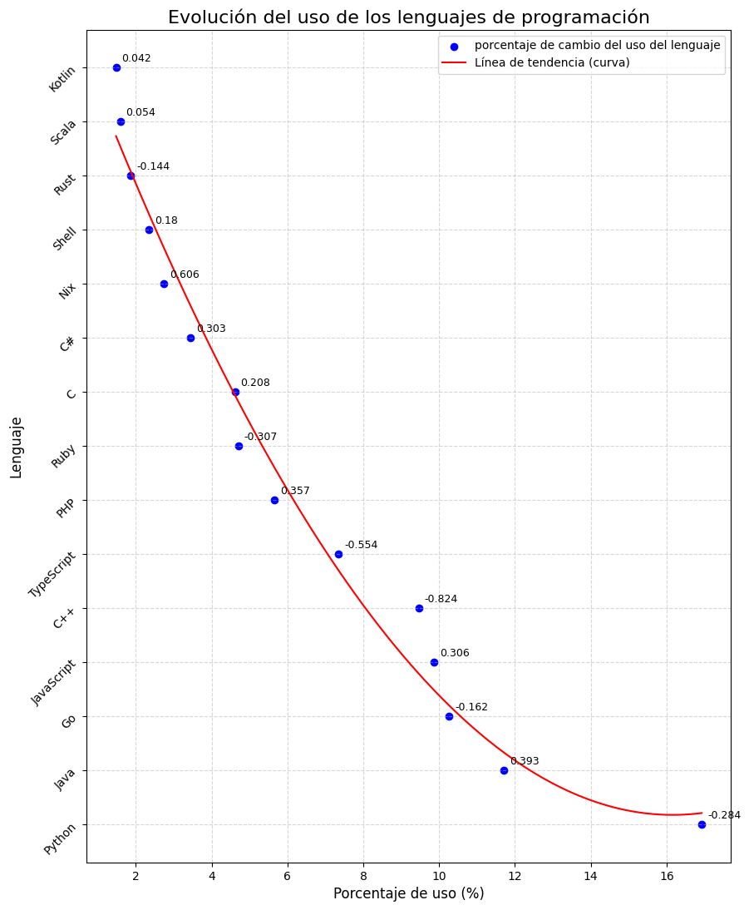

# Hipótesis y gráficas

## 1. La dificultad percibida en la implementación o uso de diferentes categorías de software varía según la categoría.

## 2. En el 2022 hubo un aumento en las búsquedas hechas en Google relacionadas a varios lenguajes de programación.

## 3. No hay relacion directa entre el costo y el crecimiento de cada categoria

## 4. La evolución del uso de los lenguajes de programación muestra una tendencia no lineal en función del porcentaje de cambio de su popularidad.

## 5. La evolución del uso de los lenguajes de programación presenta una tendencia no lineal en función de su porcentaje de cambio en popularidad.

## 6. La evolución del uso de las tecnologías de programación sigue una tendencia no lineal en función de su porcentaje de uso.

## 7. El uso de C# ha seguido una tendencia no lineal en su porcentaje de adopción entre los años 2017 y 2023.

## 8. La evolución del uso de los lenguajes de programación muestra una tendencia no lineal en su porcentaje de adopción.

## 9. Hipótesis: El trabajo con menor sueldo son los trabajos con más puestos disponibles.

## 10. A mayor años de experiencia, mayor será el salario de la persona.

